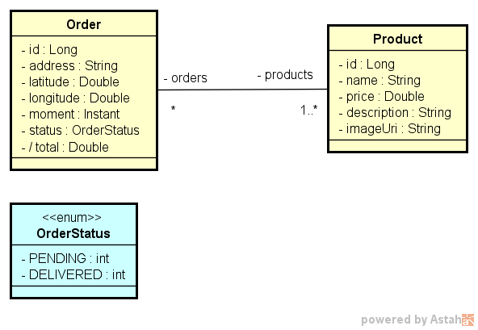
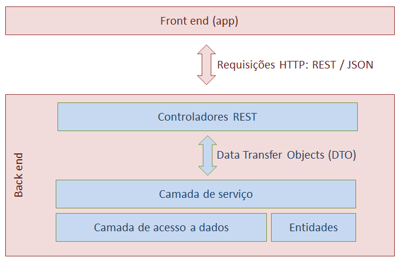

## :bookmark: Sobre o projeto
API para a criação de uma aplicação delivery mobile ou web desenvolvida 
com o framework spring, onde podem ser efetuadas operações de 
gerenciamento de pedidos (Cadastro, leitura, atualização). Os bancos de dados utilizados foram H2 
para testes em desenvolvimento e o Postegres para fins de produção.

## :rocket: Tecnologias utilizadas
- Java version 11
- Spring Boot Version 2.4.4
- Maven Version 4.0.0
- Banco H2 para teste
- Banco Postgres para produção

## :wrench: Ferramentas
- IntelliJ IDEA
- pgAdmin 4
- Heroku
- Postman

## :art: Modelo conceitual

## :hammer: Padrão camadas adotado

